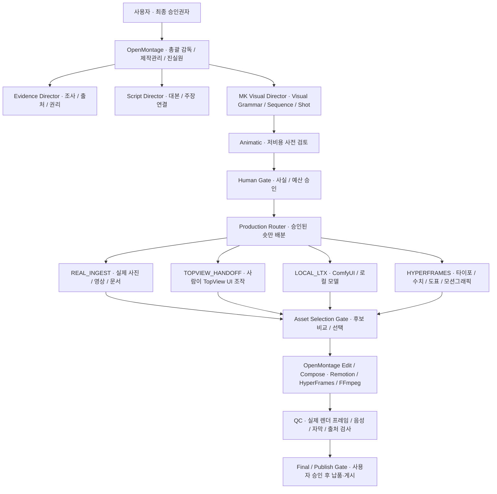

# 유튜브공장 시작 안내

이 폴더는 기존 제작 폴더와 분리된 독립 영상 제작 시스템이다. 최상위 감독과 상태 관리자는 **OpenMontage**이고, 그 안에서 **MK Visual Director**가 영상 문법과 숏을 설계한다. TopView는 사람이 웹 화면에서만 사용하는 외부 촬영 스튜디오다.

## 전체 구조



OpenMontage가 아래쪽 편집 도구가 아니라 맨 위의 총괄 감독인 이유는 간단하다. 조사부터 게시까지 단계·산출물·비용·승인을 한곳에서 기억해야, TopView나 로컬 모델이 만든 후보가 승인 없이 편집에 섞이지 않는다. MK Visual Director는 OpenMontage 내부의 전문 장면 감독이다.

## 설치와 활성화

저장소 최상위에서 다음 두 단계만 실행한다.

```bash
./scripts/bootstrap-youtube-factory.sh
source ./scripts/activate-youtube-factory.sh
```

첫 명령은 이 폴더 안의 Python 환경과 Remotion 패키지만 설치한다. 기존 `/Users/mk-macbook/Desktop/openmontage`의 설정, 프로젝트, 캐시, 모델, 인증정보를 읽거나 복사하지 않는다.

로컬 AI 영상을 실제로 시험할 때만 ComfyUI 환경을 별도로 설치한다.

```bash
./scripts/bootstrap-comfyui.sh
./scripts/start-comfyui.sh
```

모델 가중치는 Git에 들어 있지 않다. [`config/local-models.lock.json`](../../config/local-models.lock.json)에 고정된 Hugging Face 리비전과 라이선스를 확인하고, 사용자가 승인한 모델만 `.runtime/models/comfyui/` 아래에 받는다.

## 첫 프로젝트 만들기

환경을 활성화한 터미널에서 프로젝트 ID와 제목을 정한다.

```bash
python -c "from lib.checkpoint import init_project; init_project('bangjja-pilot', title='방짜유기 파일럿', pipeline_type='youtube-factory')"
python -m backlot open bangjja-pilot
```

그다음 AI 작업자에게 아래처럼 지시한다.

```text
AGENT_GUIDE.md와 pipeline_defs/youtube-factory.yaml을 먼저 읽고,
bangjja-pilot 프로젝트의 research 단계부터 시작해.
각 Human Gate에서는 다음 단계로 넘어가지 말고 내가 검토할 자료를 보여줘.
TopView는 API나 자동 브라우저 조작 없이 수동 작업지시서만 만들어.
```

## 실제 제작 순서

1. `research`에서 참고 영상, 출처, 저작권 상태, 사실을 조사한다.
2. `evidence_lock`에서 실제 날짜·수치·인용문의 근거를 사용자가 승인한다.
3. `proposal`과 `script`에서 영상 약속과 대본을 잠근다.
4. MK Visual Director가 `visual_plan`과 `scene_plan`을 만든다.
5. 애니매틱을 먼저 렌더해 이야기, 속도, 화면 전환을 검토한다.
6. 예산 승인 뒤 Router가 각 숏을 네 경로 중 하나로 보낸다.
7. 모든 제작 결과는 아직 후보이며 `asset_selection`에서 사람이 선택한다.
8. OpenMontage가 Remotion, HyperFrames, FFmpeg를 조합해 편집·합성한다.
9. 실제 렌더 파일의 프레임, 길이, 음량, 자막, 공개 라벨을 검사한다.
10. 게시 또는 외부 전달은 마지막 Human Gate 뒤에만 한다.

## 어떤 도구를 어디에 쓰는가

| 필요 | 우선 경로 | 이유 |
|---|---|---|
| 실제 인물·사건·제품·문서 | REAL_INGEST | 사실성과 출처 보존 |
| 사실적 재현, 복잡한 움직임, 인물·공간 연속성 후보 | TopView 수동 | 여러 상용 모델을 사람이 비교하기 좋음 |
| 무료 로컬 파일럿, 컨셉 확인, 프라이버시 | ComfyUI + LTX/Wan/FLUX | 외부 업로드 없이 반복 가능 |
| 날짜·수치·인용·지도·도표·자막 | HyperFrames | 정확한 글자와 결정적 렌더 |
| React 기반 장면 조립, 캡션, 최종 타임라인 | Remotion | 프로그램식 편집과 재현성 |
| 단순 컷·리사이즈·변환·음성 결합 | FFmpeg | 가장 빠르고 불필요한 렌더 비용이 적음 |

TopView가 생성한 화면 안에는 중요한 날짜·숫자·인용문을 넣지 않는다. 그 텍스트는 검증된 claim과 연결해 HyperFrames나 Remotion에서 나중에 얹는다.

## 안전 경계

- TopView API, MCP, 공식 생성 스킬, Codex 플러그인, 자동 클릭은 사용하지 않는다.
- 유료 생성은 애니매틱과 예산 승인 뒤에만 사람이 실행한다.
- TopView 결과와 로컬 생성 결과는 자동 승인되지 않는다.
- 음성 복제와 얼굴 교체는 당사자 동의 및 권리 확인 없이는 사용하지 않는다.
- 워터마크 제거는 권리 확인 전에는 사용하지 않는다.
- 게시, 삭제, 기존 프로젝트 수정은 자동으로 하지 않는다.
- ComfyUI MPS 결과는 성공 로그만 보지 말고 실제 프레임을 검사한다.

## 장부와 상세 문서

- 전체 조사와 채택 판단: [`2026-08-11-tool-skill-capability-audit.md`](../research/2026-08-11-tool-skill-capability-audit.md)
- TopView 수동 운용: [`TOPVIEW-MANUAL-RUNBOOK.md`](TOPVIEW-MANUAL-RUNBOOK.md)
- 고정 도구 버전: [`config/toolchain-lock.json`](../../config/toolchain-lock.json)
- 도구 104개 상태: [`config/tool-inventory.json`](../../config/tool-inventory.json)
- 스킬 107개 출처·해시: [`vendor/skills/manifest.json`](../../vendor/skills/manifest.json)
- 스킬별 사용 정책: [`config/factory-skill-routing.yaml`](../../config/factory-skill-routing.yaml)
- TopView 기능 카탈로그: [`config/topview-capabilities.yaml`](../../config/topview-capabilities.yaml)
- 로컬 모델 리비전·라이선스: [`config/local-models.lock.json`](../../config/local-models.lock.json)
